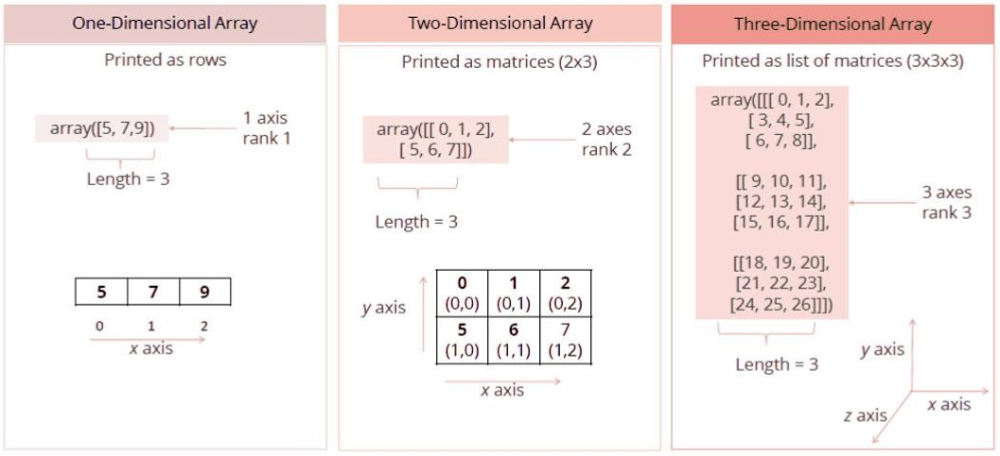

## Python Lanjutan: Dasar-Dasar NumPy


***
NumPy, yang merupakan singkatan dari Numerical Python, adalah pustaka yang terdiri dari objek array multidimensi dan kumpulan rutin untuk memproses array tersebut. Dengan menggunakan NumPy, operasi matematika dan logika pada array dapat dilakukan. Pada bagian ini, selain dasar-dasar NumPy seperti arsitektur dan lingkungannya, kita juga akan membahas berbagai fungsi array, jenis pengindeksan, dan lainnya.

Kita dapat menginstal numpy dengan perintah `pip install numpy`

- Objek utama: **`ndarray`**

# ndarray
***

Objek terpenting yang didefinisikan dalam NumPy adalah tipe array N-dimensi yang disebut ndarray. Ini menggambarkan koleksi item dari jenis yang sama. Item dalam koleksi dapat diakses menggunakan indeks berbasis nol.

Setiap item dalam ndarray mengambil ukuran blok yang sama di memori. Setiap elemen dalam ndarray adalah objek dari tipe data (disebut dtype). Setiap item yang diekstrak dari objek ndarray (dengan slicing) direpresentasikan oleh objek Python dari salah satu tipe skalar array. Sebuah instance dari kelas ndarray dapat dibuat oleh berbagai rutin pembuatan array yang akan dijelaskan nanti.

Anda dapat mengimpor fungsi dalam Python dengan memanggil `import numpy`. ndarray dasar dibuat menggunakan fungsi array dalam NumPy seperti berikut:

```python
import numpy
numpy.array
```

## Bagaimana Cara Membuat Array di Python?
***
* Membuat array dari daftar Python biasa atau tuple menggunakan fungsi array.

* Tipe array yang dihasilkan disimpulkan dari tipe elemen dalam urutan tersebut.

Ini membuat ndarray dari objek apa pun yang mengekspos antarmuka array, atau dari metode apa pun yang mengembalikan array.

```python
import numpy as np

# Dari daftar: array 1d
my_list = [10, 20, 30]
np.array(my_list)
```

```python
# Dari daftar: array 2d
list_of_lists =  [[5, 10, 15], [20, 25, 30], [35, 40, 45]]
np.array(list_of_lists)
```

```python
type(np.array(list_of_lists))
```

Contoh bagaimana array n-dimensi terlihat.

## Jenis



`ndarray` juga dikenal dengan alias `array`. Perhatikan bahwa `numpy.array` tidak sama dengan kelas `array.array` dari Perpustakaan Standar Python, yang hanya menangani array satu dimensi dan menawarkan lebih sedikit fungsi. Atribut yang lebih penting dari objek `ndarray` adalah:

***ndarray.shape***
dimensi array. Ini adalah tuple bilangan bulat yang menunjukkan ukuran array di setiap dimensi. Untuk matriks dengan n baris dan m kolom, `shape` akan menjadi `(n,m)`. Panjang tuple `shape` adalah peringkat, atau jumlah dimensi, `ndim`.

***ndarray.dtype***
objek yang mendeskripsikan tipe elemen dalam array. Seseorang dapat membuat atau menentukan dtype menggunakan tipe Python standar. Selain itu, NumPy menyediakan tipe sendiri. numpy.int32, numpy.int16, dan numpy.float64 adalah beberapa contohnya.

***ndarray.reshape***
Mengembalikan array yang berisi data yang sama dengan bentuk baru.

## numpy.dtype
***
<br/>
Tipe data atau dtype mendeskripsikan jenis elemen yang terkandung dalam array.

* **bool**: Nilai Boolean
<br/><br/>

* **int**: Nilai bilangan bulat. Bisa berupa int16, int32, atau int64.


* **float**: Nilai floating point. Bisa berupa float16, float32, atau float64.
<br/><br/>

* **string**: Teks. Bisa berupa string atau unicode (pembedaan ini sangat disederhanakan di Python 3)

## Mari Kita Coba Sendiri!
***
### Buat vektor dari daftar [10, 20, 30]. Cetak dtype dan shape.

```python
my_list = [10, 20, 30]

arr = np.array(my_list)
```

```python
arr.shape
```

```python
list_of_lists =  [[5, 10, 15], [20, 25, 30], [35, 40, 45]]
twod_array = np.array(list_of_lists)
```

```python
twod_array.shape
```

```python
my_list = [10, 20, 30]

arr = np.array(my_list)

print(arr.dtype)
print(arr.shape)
```

# Metode Bawaan NumPy

## `arange`
***
arange(**[start,]** ***stop[, step,][, dtype]***) : Mengembalikan array dengan elemen yang berjarak sama sesuai interval. Interval yang disebutkan adalah setengah terbuka yaitu **[Start, Stop)** (mirip dengan fungsi **`range()`** di Python).

```python
import numpy as np

np.arange(0, 10, 3)
```

## `zeros` dan `ones`
***
Menghasilkan array yang seluruh elemennya nol dan satu.

```python
np.zeros((2, 3))
```

```python
np.ones((2, 5))
```

## `linspace`
***
Linspace: Mengembalikan bilangan yang **berjarak sama** dalam interval tertentu.

    linspace(start, stop, num=50, endpoint=True, retstep=False)

* Akan mengembalikan `num` jumlah nilai
* Sampel berjarak sama dalam interval tertutup [start, stop] atau interval setengah terbuka [start, stop)
* Interval tertutup atau setengah terbuka tergantung pada apakah 'endpoint' bernilai True atau False.

```python
# bagi menjadi 7 interval dari 0 hingga 10
np.linspace(0, 10, 7)
```

## Bagaimana Cara Menghasilkan Angka Acak?
***
<br/>
NumPy juga memiliki banyak cara untuk membuat array angka acak dengan bentuk tertentu.

- **`rand`**: Membuat array bentuk tertentu dan mengisinya dengan sampel acak dari distribusi **uniform**.

- **`randn`**: Membuat array bentuk tertentu dan mengisinya dengan nilai acak sesuai distribusi **normal standar**.

- **`randint`**: Mengembalikan bilangan bulat acak dari distribusi "uniform diskrit" dalam interval setengah terbuka [low, high).

```python
# array angka acak (distribusi uniform) dengan bentuk (3, 4)

np.random.rand(3, 4)
```

```python
# array angka acak (distribusi normal standar) dengan bentuk (2, 3)

print(np.random.randn(2, 3))
```

```python
# 10 bilangan bulat acak antara 4 (inklusif) hingga 40 (eksklusif)

np.random.randint(4, 40, 10)
```

```python
# 10 bilangan bulat acak hingga 50 (eksklusif). Nilai awal default menjadi 0.
# Parameter size menentukan bentuk array yang dikembalikan.

np.random.randint(50, size=(4,4))
```

