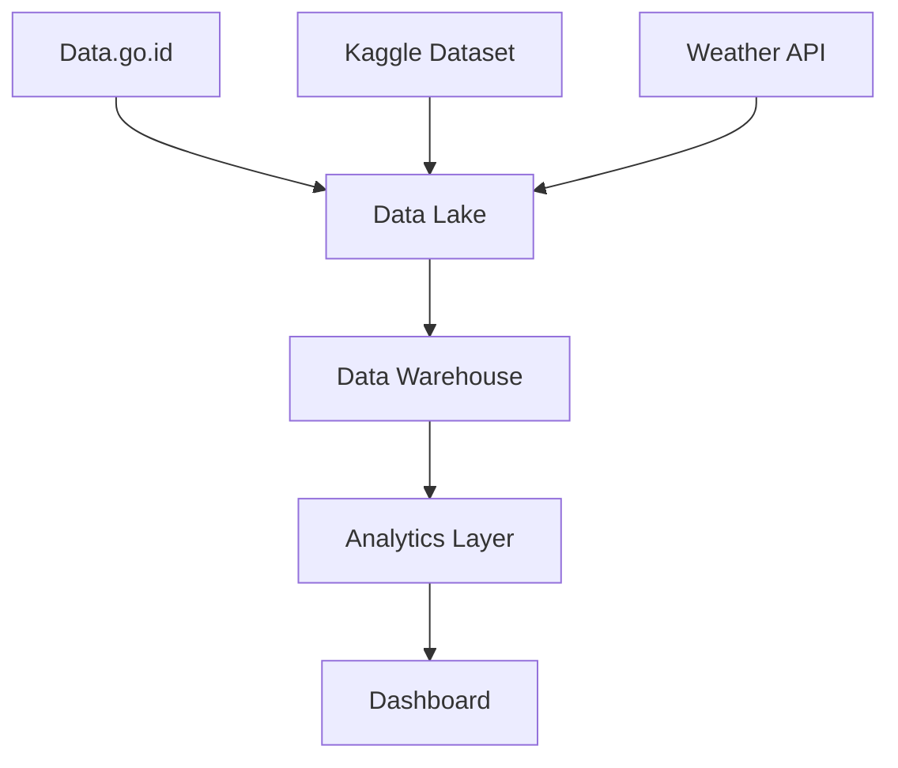

## **Team Project**: Open Data Source Analysis & Planning

- Eksplorasi sumber data terbuka (Open Data):
  - Data pemerintah (data.go.id)
  - Dataset Kaggle
  - Public APIs (Weather, Transport, etc.)
  - Open research data
- Analisis karakteristik dan kualitas data
- Membuat peta alur data untuk integrasi
- Dokumentasi requirement dan rencana penggunaan
- Output: Project blueprint dan documentation

# Open Data Source Analysis & Planning Project

## Project Information

**Project Name**: Jakarta Public Transportation Analytics
**Created By**: Data Engineering Team Alpha
**Date**: February 10, 2025
**Version**: 1.0

## 1. Executive Summary

### 1.1 Project Overview

- **Tujuan Project**: Mengembangkan sistem analitik untuk mengoptimasi rute transportasi publik Jakarta menggunakan berbagai sumber open data
- **Scope Project**: Integrasi data transportasi, cuaca, dan demografi untuk analisis pola pergerakan
- **Expected Outcomes**: Dashboard analitik real-time dan sistem rekomendasi rute
- **Timeline**: 3 bulan (Maret - Mei 2025)

### 1.2 Stakeholders

- **Project Owner**: Dinas Perhubungan DKI Jakarta
- **Team Members**:
  - Data Engineer: Sarah Wijaya
  - Data Analyst: Budi Prakoso
  - Project Manager: Amanda Sari
- **End Users**:
  - Dinas Perhubungan
  - Operator Transportasi
  - Masyarakat umum

## 2. Data Source Analysis

### 2.1 Data Pemerintah (data.go.id)

#### Source Details

- **Dataset Name**: Statistik Transportasi DKI Jakarta 2024
- **URL/Access Point**: data.go.id/dataset/statistik-transportasi-dki-2024
- **Data Owner**: Dinas Perhubungan DKI Jakarta
- **Update Frequency**: Monthly

#### Data Analysis

- **Format Data**: CSV, Excel
- **Volume Data**: 500MB
- **Time Coverage**: Januari 2024 - Desember 2024
- **Data Quality**:
  - Completeness: 95% (beberapa data kosong untuk hari libur)
  - Accuracy: High (verified by Dishub)
  - Consistency: Good (format standar)
  - Timeliness: Updates within 5 days of month end

### 2.2 Dataset Kaggle

#### Source Details

- **Dataset Name**: Jakarta Public Transport Usage Patterns
- **URL/Access Point**: kaggle.com/datasets/jakarta-transport-2024
- **Creator/Publisher**: Jakarta Data Community
- **Last Update**: January 15, 2025

#### Data Analysis

- **Format Data**: Parquet
- **Size & Dimensions**: 2GB, 12 million rows
- **Data Fields**:
  - timestamp
  - station_id
  - passenger_count
  - vehicle_type
  - weather_condition
- **Quality Metrics**:
  - Missing Values: 2% (mainly in weather_condition)
  - Data Types: Properly formatted
  - Consistency: High
  - Documentation Quality: Excellent, includes data dictionary

### 2.3 Public APIs

#### Source Details

- **API Name**: OpenWeather API
- **Endpoint URL**: api.openweathermap.org/data/3.0/
- **Provider**: OpenWeather
- **Authentication Method**: API Key

#### API Analysis

- **Response Format**: JSON
- **Rate Limits**: 60 calls/minute
- **Reliability**: 99.9% uptime
- **Documentation Quality**: Comprehensive
- **Cost**: Free tier sufficient for project needs

### 2.4 Open Research Data

#### Source Details

- **Dataset Name**: Jakarta Urban Mobility Study 2024
- **Repository**: Harvard Dataverse
- **Research Institution**: Institut Teknologi Bandung
- **Publication Date**: December 2024

#### Data Analysis

- **Format & Structure**: CSV + GeoJSON
- **Data Volume**: 1.5GB
- **Data Quality**: Peer-reviewed
- **Citation Requirements**: CC BY-NC-SA 4.0

## 3. Data Flow Mapping

### 3.1 Data Integration Architecture

### 3.2 ETL Process Design

- **Extraction Methods**:
  - Data.go.id: Monthly batch download
  - Kaggle: One-time bulk load
  - Weather API: Real-time streaming
- **Transformation Rules**:
  - Standardize timestamps to UTC+7
  - Geocode station locations
  - Normalize weather conditions
- **Loading Procedures**:
  - Incremental loads for streaming data
  - Full refresh for monthly batches
- **Scheduling**:
  - Weather data: Every 5 minutes
  - Usage data: Daily at 00:00
  - Statistics: Monthly at 1st

%% System Architecture Diagram
graph TD
subgraph Data Sources
A[Data.go.id] --> ETL
B[Kaggle Dataset] --> ETL
C[Weather API] --> ETL
D[Research Data] --> ETL
end

subgraph Data Processing
    ETL[ETL Layer]
    DL[(Data Lake)]
    DW[(Data Warehouse)]
    ETL --> DL
    DL --> DW
end

subgraph Analytics
    AN[Analytics Engine]
    DS[Data Science Models]
    DW --> AN
    DW --> DS
end

subgraph Applications
    API[REST API]
    DASH[Dashboard]
    AN --> API
    DS --> API
    API --> DASH
end
%% ETL Workflow
sequenceDiagram
participant S as Source Systems
participant E as Extraction
participant T as Transformation
participant L as Loading
participant DW as Data Warehouse

S->>E: Raw Data
E->>T: Extracted Data
T->>L: Transformed Data
L->>DW: Loaded Data
---

**Kita ingin menganalisis hubungan antara tingkat pendidikan, pengangguran, dan pendapatan di suatu negara.**

**Dataset:**

* **World Bank Open Data:** Data tentang tingkat pendidikan ([https://data.worldbank.org/](https://www.google.com/url?sa=E&q=https%3A%2F%2Fdata.worldbank.org%2F))
* **ILOSTAT:** Data tentang tingkat pengangguran ([https://ilostat.ilo.org/](https://www.google.com/url?sa=E&q=https%3A%2F%2Filostat.ilo.org%2F))
* **Our World in Data:** Data tentang pendapatan per kapita ([https://ourworldindata.org/](https://www.google.com/url?sa=E&q=https%3A%2F%2Fourworldindata.org%2F))
